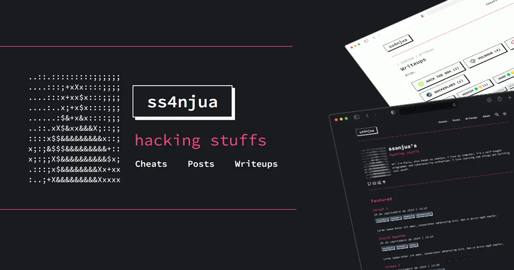

# About Me

Hello! I'm Paula, a **Full Stack Developer** who is passionate about cybersecurity. In my free time, I'm learning about this fascinating field and solving machines on various platforms. You can check out my projects on my [portfolio](https://ssanjua.vercel.app) and follow my journey on [Linktree](https://ss-link.vercel.app/) and also my Portfolio terminal [portfolio](https://ssanjuaterminal.vercel.app).

I firmly believe that all IT professionals should learn more about cybersecurity. The **Introduction to Hacking** course from Hack4u opened my eyes and is helping me think about web development securely.

If you’d like to get in touch, feel free to contact me via email or through my social media:

- [GitHub](https://github.com/ssanjua)
- [LinkedIn](https://www.linkedin.com/in/paupallares/)
- [Email](mailto:ppaupallares@gmail.com)

Thank you for visiting my blog! I hope you find the information I share about cybersecurity useful.

